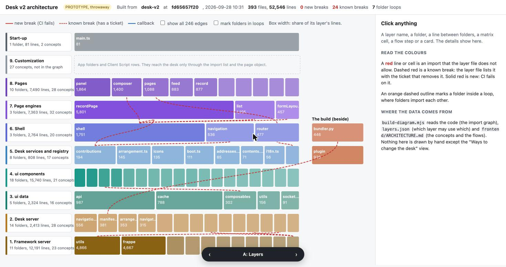

# Desk v2 architecture diagram: a rough version to react to

**PROTOTYPE, throwaway.** This folder answers the questions in
[the diagram prototype ticket](https://github.com/frappe/frappe/issues/43434). The real
diagram and the CI check are a separate build task. Nothing here is product code: it adds
no route, no DocType and no request to the desk.



## Run it

```sh
node research/desk-v2-architecture-diagram/build-diagram.mjs
open research/desk-v2-architecture-diagram/diagram.html
```

The script needs Node 18 and nothing else. It takes about 0.2 seconds. It rebuilds the
import graph with the structure research script, checks every import against the layer
file, reads the concept tables and the five flows from `frontend/ARCHITECTURE.md`, and
writes one HTML file that opens from disk.

Switch views with the bar at the bottom, the left and right arrow keys, or `?view=A` to
`?view=D` in the address. In the flow view, the up and down arrow keys move between steps.

| File | What it is |
| --- | --- |
| `layers.json` | The draft layer file: layers, their paths, what each may use, today's breaks |
| `build-diagram.mjs` | Builds the graph, runs the check, writes `diagram.html` |
| `diagram.template.html` | The page. The script puts the data into it |
| `diagram.html` | The built page, committed so the branch can be opened without running anything |
| `graph.json` | The import graph at `desk-v2` `fd65657f20` |

The branch is `desk-v2` at `9ce1d900cd` plus the structure research commit. The graph did
not change since the research: 73 folders and 244 edges.

## What the check found

Today's code breaks the layer file in **24 file pairs at 12 import sites**. Each site is a
row in the gap list of `ARCHITECTURE.md`, and each one has an open ticket that removes it.
So `layers.json` lists all 12 as known breaks, and the check passes.

| Site | Breaks | Removed by |
| --- | --- | --- |
| `frappe/utils/data.py` uses `frappe/shell/links.py` | 1 to 2 | #43493, one record address builder |
| `frappe/bundler.py` uses `frappe/shell/manifest.py` | build to 2 | #43456, the manifest moves into the build |
| `frappe/website/page_renderers/shell_page.py` uses `frappe/shell/` | 1 to 2 | #43495, the renderer moves into `frappe/shell/` |
| `public.ts` uses `router/routeFor.ts` | 5 to 6 | #43494, `routeFor` and the item contract move to layer 5 |
| `contributions/` uses `navigation/types.ts` | 5 to 6 | #43494 |
| `contributions/registry.ts` uses `recordPage/` | 5 to 7 | #43453, the shell stops importing pages |
| `shell/doctypeUpdates.ts` uses the form layout cache | 6 to 7 | #43453 |
| `shell/doctypeUpdates.ts` uses the list settings cache | 6 to 7 | #43453 |
| `shell/ComposerWindow.vue` uses `pages/record/composer/` | 6 to 8 | #43450, writers by registration |
| `shell/composer.ts` uses `recordPage/` types | 6 to 7 | #43450 |
| `router/` uses `pages/` | 6 to 8 | #43486, the router gets every page by registration |
| `useDoctypeMeta.ts` uses `components/FormLayout/` | 3 to 4 | #43481, the data composables move to `ui` data |

Three things differ from what earlier tickets said:

- **The count is 12 sites, not 5.** The structure research and the guardrails ruling
  both say "5 frontend breaks". Under the target layers there are 8 frontend sites, 1 in
  `ui/` and 3 on the server. The research counted `main.ts` as a break, but the target
  puts `main.ts` above every layer, so it is not one. The research also did not count the
  router, `routeFor` and the item contract as breaks. The structure checks ticket
  (#43499) must start from 12.
- **The loop between `ui/src/api` and `ui/src/cache` has no ticket.** The gap list gives
  it to the @framework/ui map, but no ticket on that map covers it. It is inside one
  layer, so the loop check carries it, not the layer file.
- **The four data composables.** `ARCHITECTURE.md` names `useSession`, `useDoctypeMeta`,
  `useDocPermissions` and `useUserRoles`. The ticket that moves them (#43481) names the
  last three and the activity timeline store, and says `useSession` is already in place.
  It is not: it sits in `ui/src/composables/` with the other three. `layers.json` puts
  all four in layer 3 by file path, so the check already treats them as `ui` data.

## Answers to the ticket's questions

These are recommendations to react to. Nothing here is ruled.

### 1. The views

| View | What it shows | Recommendation |
| --- | --- | --- |
| A. Layers | Nine rows, one box per folder sized by its share of the layer's lines. Red lines for breaks, all edges on demand, loops on demand | **Keep.** It is the one picture a new reader needs. The 18 folders in `ui` components are too narrow for a label; the name shows on hover and click |
| B. Layer matrix | Which layer uses which, with counts. The rule and the code in one table. The 7 folder loops below it | **Keep**, as the second view. It is what the CI check computes, so it explains a CI failure best |
| C. Flows, step by step | The five flows from `ARCHITECTURE.md`. Each step lights its layers and shows its permission check and its cache and key | **Keep, with more data.** It cannot show the request of a step, or the files a step passes through, because `ARCHITECTURE.md` gives only layers per step. Add a request column to the five flow tables. Files per flow come from the flow printout in #43499 |
| D. Ways to change the desk | 25 ways, by app, site admin and user, with 7 rows that name a pair doing the same job | **Leave out of the diagram** for now. The code has no one list of these, so this view is kept by hand and will drift. If `ARCHITECTURE.md` gets an extension-point table, the script can read it the way it reads concepts |

### 2. What one click shows

| Click on | Shows |
| --- | --- |
| A layer | Size, what it may use, what it uses and what uses it with break counts, the closed concept list, a link to its section of `ARCHITECTURE.md` |
| A folder | Size and files, what it uses and what uses it, the loop it is in, its npm packages |
| A line or a matrix cell | Allowed, same layer, callback or break. The rule. Each file pair with a link to the import line. For a known break: why, and the ticket that removes it. For a new break: what to do |
| A flow step | Its layers, its permission check, its cache and key |

Two things the ticket asked for are not there:

- **Concepts per folder.** `ARCHITECTURE.md` lists concepts per layer, not per folder. A
  folder click links to its layer's list. A folder column in the concept tables would fix
  this, but it adds upkeep for little gain.
- **The ruling for each concept.** No concept row names a ruling. `ARCHITECTURE.md` is
  itself the record of the ruling (#43441 wrote it from the target architecture, #43432).
  The click links to its section. For a break, the ticket is the ruling.

### 3. Where it lives

**Ruled by the user on 2026-09-28: on the site, at a route, in developer mode.** The
prototype first recommended a file opened from disk. The ticket's rule of "no route" was
for the prototype only.

The shape for the build task:

- **Route `/desk-architecture`.** Not under `/apps`: that address root belongs to the
  shell and its app prefixes, and the reserved route guard refuses anything else there.
- **A page renderer**, found through the `page_renderer` hook the same way as the shell
  page. It returns the whole HTML page. A `www/` page is harder: the website wraps any
  `www` template that has no `</body>` in the site's base template.
- **Only in developer mode.** Without `developer_mode`, the route is "not found". The test
  pages under `frappe/www/_test` use the same gate in `frappe/website/path_resolver.py`.
  In developer mode, only a System Manager sees the page.
- **Built on each request.** The renderer runs the script, which takes about 0.2 seconds.
  So the page shows the working tree as it is, with edits not yet committed, and a
  developer sees a red line while writing the import. It needs `node` and `git`, which a
  development bench has.
- **CI does not change.** It runs the same script as the check, and uploads the built
  page on each PR, so a reviewer without a development site can still see it.
- **The built page is not committed.** It would go stale after each merge. This prototype
  commits it only so the branch can be opened without running anything.
- **It is a new concept.** `ARCHITECTURE.md` gets a row for the route under "Outside the
  layers", beside the build. The renderer and the script live with the build code, not in
  a layer, because the running desk never uses them.

### 4. How it stays current

- **In CI, on every PR.** The check runs in the Frontend / Unit Tests job, as the
  guardrails ruling says. The same step writes `diagram.html` and uploads it.
- **By hand, at any time**, with the command under "Run it".
- **What a red line means for a reader:**
  - A **new break** fails CI. The script prints the file, the line and the target. The
    author changes the import. If the rule is wrong, the author changes `layers.json` in
    the same PR. `ARCHITECTURE.md` says a new "may use" edge needs a ruling.
  - A **known break** is dashed red and does not fail. The panel names the ticket that
    removes it.
  - A **file in no layer** fails CI, so a new folder must be placed in a layer.
  - A **known break that is gone**: the script prints `FIXED ... remove it from
    knownBreaks`. The prototype only prints this. The real check must fail on it, so the
    list only gets shorter and stays true. This matches the guardrails rule that a PR may
    lower a baseline.

### 5. The layer file's format

JSON, in `frontend/layers.json`. The Node check and the Python server layer test can both
read it with no extra package. The budgets stay in their own file, as the guardrails ruled.

```json
{
  "architecture": "frontend/ARCHITECTURE.md",
  "notUse": { "hook": "why a hooks.py callback is not a use", "virtual": "..." },
  "layers": [
    { "id": "6", "name": "Shell", "section": "6-shell",
      "paths": ["frontend/src/shell/", "frontend/src/navigation/", "frontend/src/router/"],
      "mayUse": ["5", "4", "3", "2", "1"] }
  ],
  "knownBreaks": [
    { "from": "frontend/src/router/", "to": "frontend/src/pages/",
      "why": "The router imports the standard pages.",
      "ticket": 43486, "title": "Shell and routes: the router gets every page by registration" }
  ]
}
```

The rules of the format:

- A file belongs to the layer whose path is the **longest prefix** of the file's path. So
  `frontend/src/` is layer 5, and `frontend/src/shell/` inside it is layer 6. One file can
  be placed alone, as the four data composables are.
- `mayUse` lists layers by id. The check does not assume "everything below", because
  layers 3 and 4 may use only layer 1, not layer 2.
- `notUse` names the edge kinds that are not a use. Today: a `hooks.py` entry that a lower
  layer calls back, and the build's generated contributions module.
- `section` and `table` tie a layer to its concept table in `ARCHITECTURE.md`. The diagram
  reads the concepts from there, so the concept list stays in one place.
- `knownBreaks` match by path prefix, and each names its ticket.
- Type-only imports count. The gap list counts `shell/composer.ts`, which imports only
  types.

The target architecture ticket fixes the content. The ids, paths and `mayUse` lists in
`layers.json` follow `ARCHITECTURE.md` as merged.

## What the prototype leaves out

- Layer 9 has no box. App folders and Client Script rows are not in the import graph.
- Layer 1 shows only the framework files that desk code reaches. The graph script does
  not read all of `frappe/`.
- The folder boxes are sized within their layer, so a box in one layer cannot be compared
  with a box in another. The layer label gives the totals.
- No test, no error handling beyond what the page needs to run.
