# Desk v2 user experience: what a person sees while a page loads, fails and saves

Research for the question on frappe/frappe#43430: *what does a person see while each desk v2
page loads, fails and saves, and is it the same on every page?* It is one of the research
tickets under the desk v2 architecture map (frappe/frappe#43426), which ranks user experience
second, after security. This file records what was on screen. It decides nothing.

## How this was walked

| Item | Value |
| --- | --- |
| Commit walked | `6352fefbdf` (head of `upstream/desk-v2` on 2026-09-28). The served bundle in `frappe/public/frontend` was built from the shared checkout at this commit on 2026-09-26, four minutes after the commit landed. |
| Site | `crm.localhost:8099` (Vite dev server; `/apps/*` is the built bundle, API calls go to the backend on :8019). Apps on the site: frappe, crm, erpnext, gameplan. |
| Driver | Playwright 1.62.1, headless Chromium, 1440 × 900, a fresh browser per cold step. |
| Pages | CRM's app at `/apps/crm`: home, the `CRM Lead` list, the lead `CRM-LEAD-2026-00002`. The framework app at `/apps/desk`: home and the ToDo `4nsga6mev4`. |
| Users | `Administrator`; `lena.fischer@example.com` (an ordinary user) for the permission steps. |
| Slow network | Chrome's old "Slow 3G" numbers, the same the repo's return-visit walk in `frontend/walks/setup.js` uses: 400 ms latency, 400 kbit/s each way. |
| Offline | `context.setOffline(true)` after the page had loaded. |
| Data put back | Every edited field was set back and read back (leads `-00002` and `-00004`, ToDo `4nsga6mev4`); the Version rows the test saves wrote were deleted. Administrator's stored CRM Lead sort, which a header click overwrote, was set back to Status ascending. The records' `modified` stamps moved. |
| Caveat | A speed-measuring walk ran on the same site at the same time, so the seconds on the slow network are rough. |

What each column in the walk table means:

- **Loading**: what the content area showed between the action and the settled page, in order. "Blank" means a white page with no shell at all.
- **Paints**: animation frames in which the content area's DOM changed, from the action until 600 ms with no change and no request. 1 would be ideal; each extra paint is something that visibly redrew.
- **Shift**: the browser's layout-shift score for the step (shifts within 500 ms of a click or key press are left out, as browsers do). Above 0.1 is what Chrome calls "poor".
- **Focus**: `document.activeElement` when the step settled.

The walk scripts are not committed; they lived in `/tmp` and drove the pages the same way
`frontend/walks/returnVisit.js` does, with the same skeleton selectors
(`frontend/walks/paintCounters.js`).

## 1. Walk table

### Open pages, normal network

| Step | Loading | Paints | Shift | Focus | Settled after |
| --- | --- | --- | --- | --- | --- |
| Home, cold (`/apps/crm`) | Blank ~120 ms, tile skeleton for one frame, tiles | 3-4 | 0.03 | body | ~0.14 s |
| Home, return (Back) | Tile skeleton 7-38 ms, tiles again. Not cached: every visit refetches | 4 | 0 | body | ~0.6 s |
| List, first visit (click the "CRM Lead" tile) | Skeleton (quick filters, sort, header, 10 rows) for ~30 ms, rows | 5-6 | 0 | body | ~0.14 s |
| List, cold (full load) | Blank ~150 ms, skeleton ~25 ms, rows | 4-5 | **0.19** | body | ~0.2 s |
| List, return (Back, Forward, sidebar) | Rows from memory, but one frame of skeleton rows first, then a redraw when the refetch lands | 3-5 | 0 | body (sidebar link after a sidebar click) | ~0.6 s |
| Record, first visit (row click) | Skeleton (header, tabs, 2-column form, panel) ~6 ms, record, then the activity feed fills in at ~0.8 s | 7-9 | 0 | body | ~0.8 s |
| Record, cold (full load) | Blank ~180 ms, skeleton ~7 ms, record | 5-7 | **0.17** | body | ~0.3 s |
| Record, return (Back or row click) | No skeleton; painted from memory, one quiet redraw at ~0.7 s | 2-4 | 0 | body | ~0.7 s |
| ToDo record, cold (`/apps/desk/todo/...`) | Blank ~240 ms, skeleton ~4 ms, record | 4-5 | 0.03 | body | ~0.3 s |

Where the shift comes from (from the browser's layout-shift sources):

| Page | Shift | What moved |
| --- | --- | --- |
| List and record, cold | 0.150 | The whole content pane draws first at full width, then the sidebar column (224 px) mounts and pushes it right: x 50 → 274. |
| List, cold | 0.018 × 2 | The table moves 36 px down and back up while the quick-filter row swaps its skeleton for inputs. |
| Record, cold | 0.017 | Activity rows move 99 px down when the feed's first item arrives. |
| Home, cold | 0.03 | The content moves 48 px down when the page header mounts after it. |
| Home → list, slow network | 0.19 | The same sidebar push, now outside the 500 ms input window, so it counts. |

### Open pages, slow network

| Step | What the person sees | Settled after |
| --- | --- | --- |
| Home, cold | **White page for 32 s** (no shell, no spinner), tile skeleton 0.7 s, tiles | 50 s |
| List, cold | **White page for 44 s**, skeleton 8 s, rows | 58 s |
| Record, cold | **White page for 73 s**, skeleton 5 s, record | 99 s |
| ToDo record, cold | White page for 78 s, skeleton 1 s, record | 82 s |
| List, first visit (tile click on home) | **The home page stays for 6.5 s with no sign the click did anything**, then skeleton 3 s, rows | 10.5 s |
| Record, first visit (row click on list) | **The list stays for 26 s with no sign the click did anything**, then skeleton 0.7 s, record | 31 s |
| List, return | Skeleton rows for 0.46 s on every return, then rows | ~0.5 s |
| Home, return | Tile skeleton for 0.45 s on every return | ~0.5 s |
| Record, return | Painted at once from memory, no skeleton | at once |

The white page lasts until the shell's code and the page's code have both downloaded; the
rail and sidebar do not draw before the page does. The pause after a click is the router
waiting for the next page's code before it changes the page: `router.beforeResolve((to) =>
preloadMainPage(to, addresses))` at `frontend/src/router/index.ts:74`. Nothing on screen marks
that wait (no progress bar, no pressed state). The speed of the bundle itself belongs to the
speed research running beside this one; this table only says what a person looks at meanwhile.

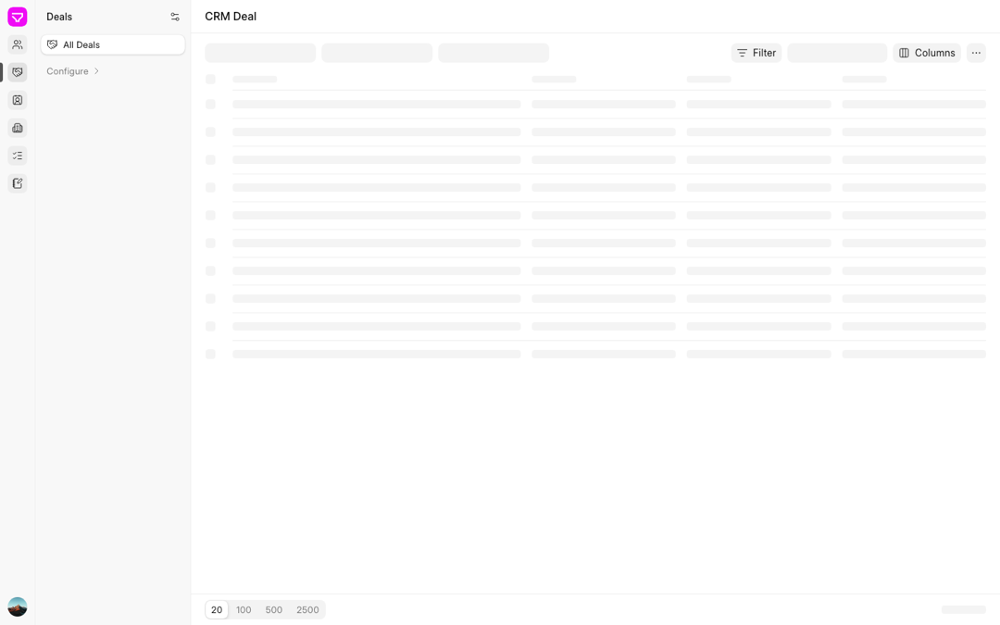

*List skeleton (API calls held for 3 s): 4 skeleton columns; the settled Deals list has 5.*

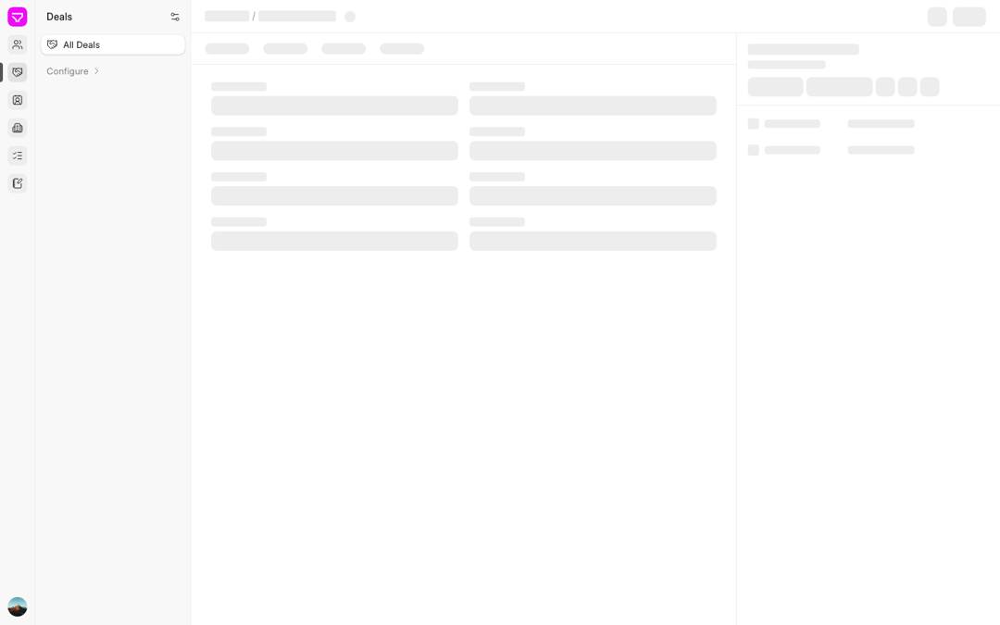
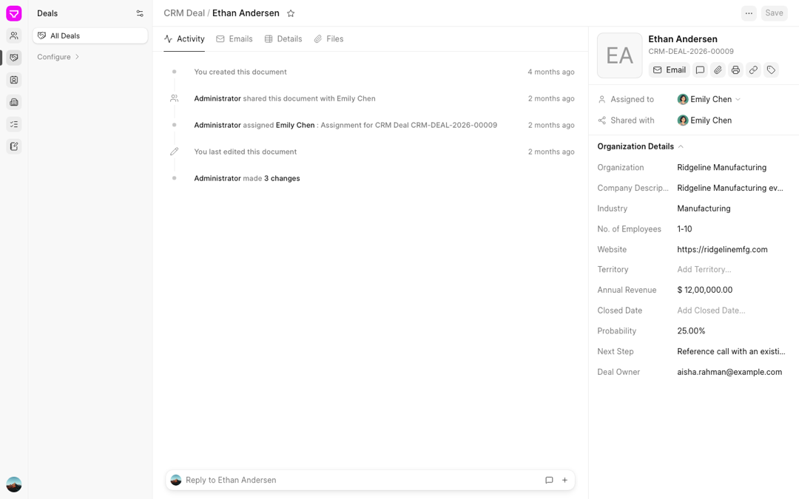

*Record skeleton and the page it turns into. The skeleton draws a 2-column form and a short
panel; the page opens on the Activity timeline and a panel with an avatar block.*

### Filter and sort a list (CRM Lead)

| Step | What happens | Paints | Shift | Focus |
| --- | --- | --- | --- | --- |
| Type "Bob" in the "Full Name" quick filter | Nothing for ~1 s (300 ms plus 500 ms wait for typing to stop), then the rows are removed, one frame of skeleton rows (0.4 s on slow), then 1 row. URL gets `?lead_name=["LIKE","%Bob%"]` by replace | 4 | **0.60** | stays in the input |
| Same, no match | "No records" in the middle of the table; the footer reads "0 of 0" | 1-3 | 0 | input |
| Clear the filter | Skeleton frame, 20 rows back | 3 | 0 | input |
| Click the "Full Name" column header | Skeleton frame (0.45 s on slow), rows sorted. The URL does not change. The sort is saved to the person's list settings | 5 | 0 | header button |
| Back after filtering or sorting | Leaves the list: filter and sort use `router.replace`, so they add no Back step (`writeQuery` in `frontend/src/list/useListPage.ts:165-167`) | - | - | - |

The 0.60 shift on the first filter has two parts: the table shrinks from 20 rows to 1, and
the quick-filter row reflows. When a filter is set, the "Filter" button grows to "Filter 1 ×",
and the "Organization" quick filter drops into the overflow menu ("2 more" becomes "3 more"),
next to the input the person is typing in.

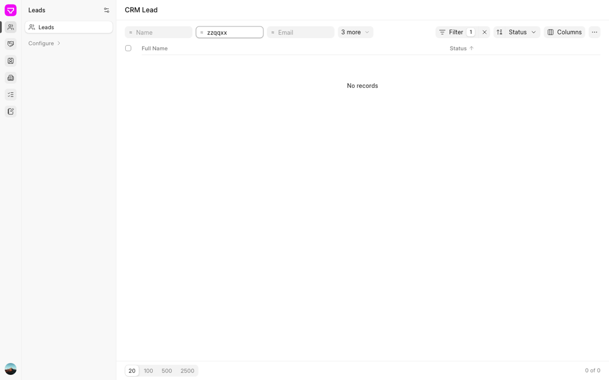

### Edit and save (lead `CRM-LEAD-2026-00002`, panel field "Job Title")

| Step | What the person sees | Focus after |
| --- | --- | --- |
| Click the value, type, press Enter | The panel field turns into an input; after Enter it turns back. The Save button in the header turns from grey to black | **body** (focus is dropped) |
| Ctrl/Cmd+S | The Save button shows a spinner (~0.4 s; ~0.5 s on slow), then turns grey again. **No toast, no "Saved" text**; the feed gains a "changed Job Title" row | body |
| Ctrl/Cmd+S with nothing changed | Toast "No changes to save" | body |
| Click Save | Same as Ctrl+S | body |

### Save with an error

| Case | What the person sees | Field marked? | Edit kept? | Focus |
| --- | --- | --- | --- | --- |
| Invalid email (server 417) | Toast bottom right: "not-an-email is not a valid Email Address". The toast sits over the panel's last rows | No | Yes, Save stays active | body |
| Mandatory field empty (ToDo "Description") | Toast: "Error: Value missing for ToDo: Description". The header title changes to the record's ID while the draft has no description | No (the field keeps its usual red `*`) | Yes | stays where it was |
| Someone else saved first | Dialog "Saved by someone else": "Administrator saved this record after you opened it, so your changes to Color cannot be saved over theirs. Reload to see their version, or keep editing to copy your values out first." Buttons "Keep editing", "Reload and lose my changes". It fired even though the other person changed a different field | - | Yes until Reload | the dialog's close (×) button |
| Leave with unsaved changes | Dialog "Discard unsaved changes?" / "This record has changes that are not saved." Buttons "Discard", "Keep editing" | - | - | the dialog's close (×) button |

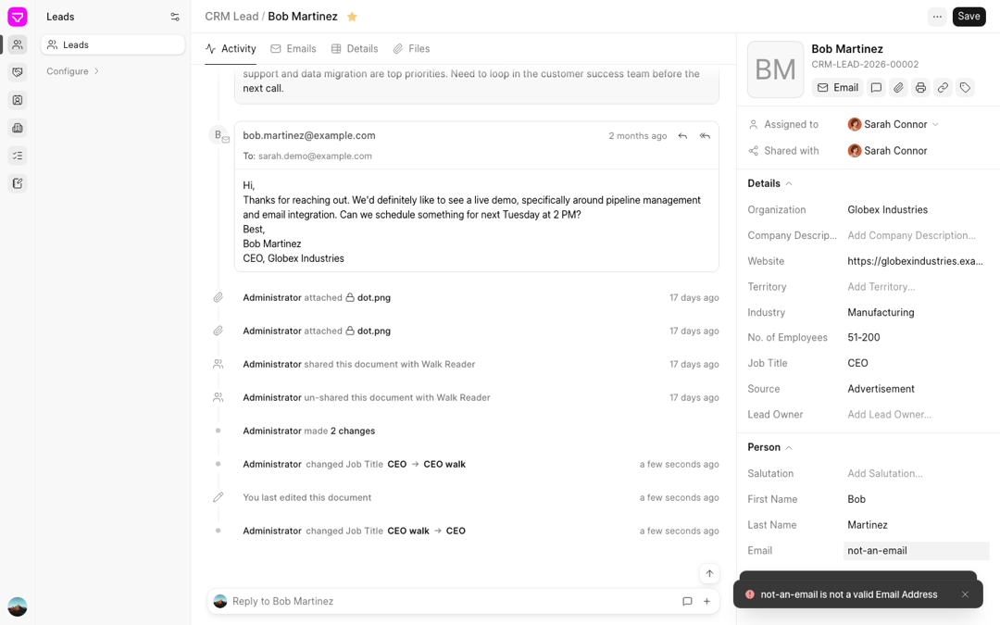
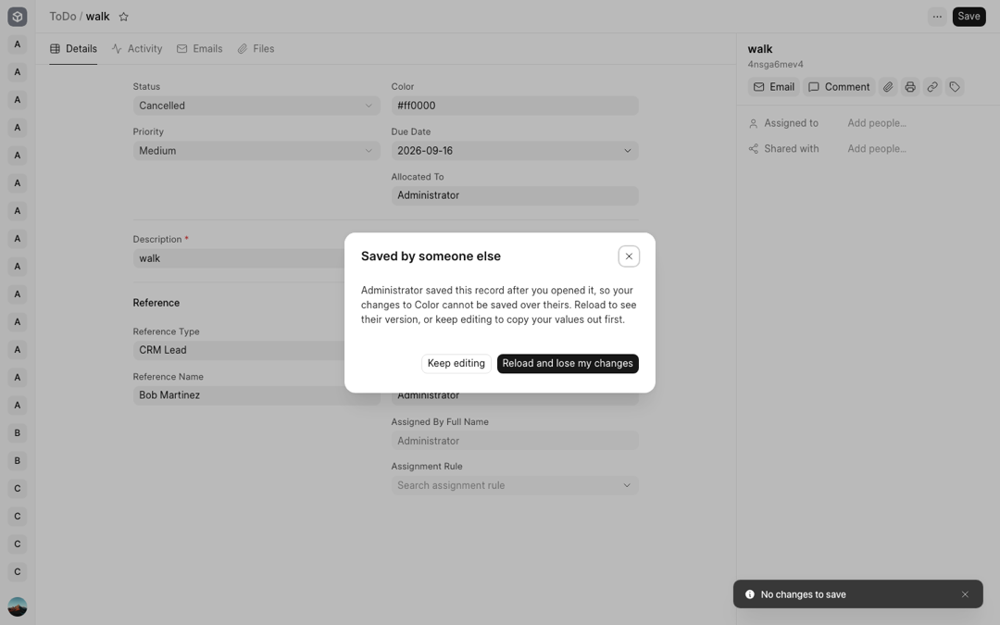

### Records and pages that cannot open

| Case | What the person sees | Shift |
| --- | --- | --- |
| Record that does not exist (`/apps/crm/crm-lead/CRM-LEAD-NOPE`) | Skeleton flash, then the header "CRM-LEAD-NOPE · CRM Lead" and a small red line "Not found." at the top left. The rest of the pane is empty | 0.15 |
| Record with no permission (Lena opens `/apps/desk/user/Administrator`) | Same layout: header "Administrator · User", red line "You do not have permission to read this record." | 0.03 |
| Unknown address or doctype (`/apps/desk/no-such-doctype`) | A different page: centred "Not found" / "This page does not exist." and a faint "Back to apps" link | 0 |
| List with no permission (Lena opens Error Log) | The list controls still draw (quick filters, Filter, sort, Columns, page sizes). Under them, red text with **raw HTML tags**: `Insufficient Permission for <strong>Error Log</strong>`. The footer count stays a grey skeleton bar for good | 0.08 |

Every page's browser tab title is "Frappe": `frontend/index.html:23` sets it and nothing in
`frontend/src` or `ui/src` changes `document.title`. Tabs and the browser's history menu cannot
tell a list from a record.

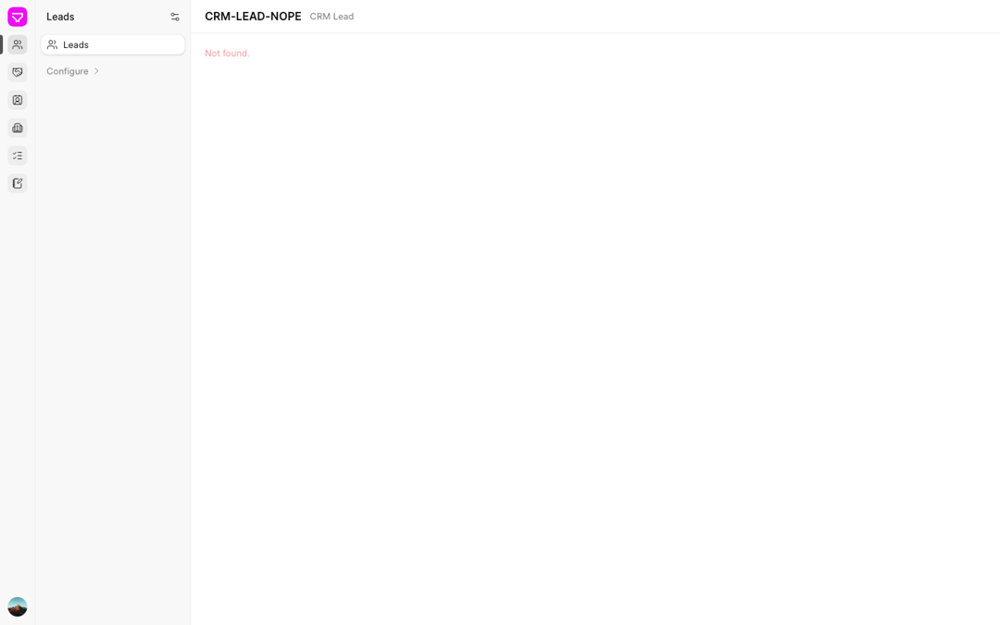
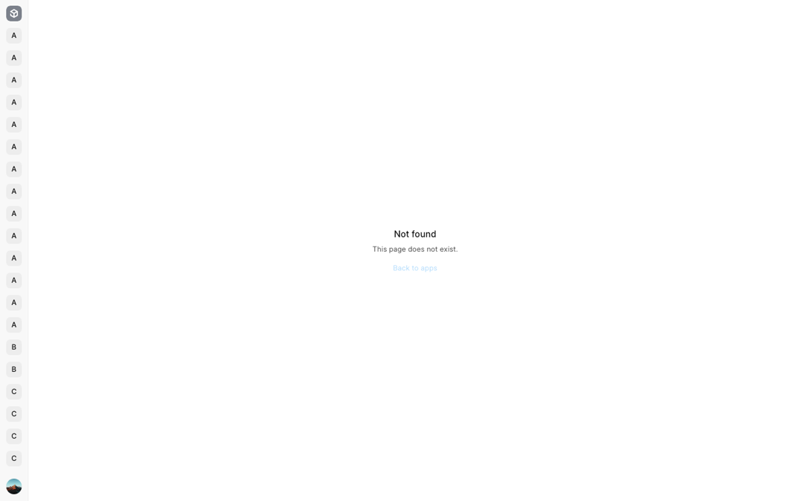
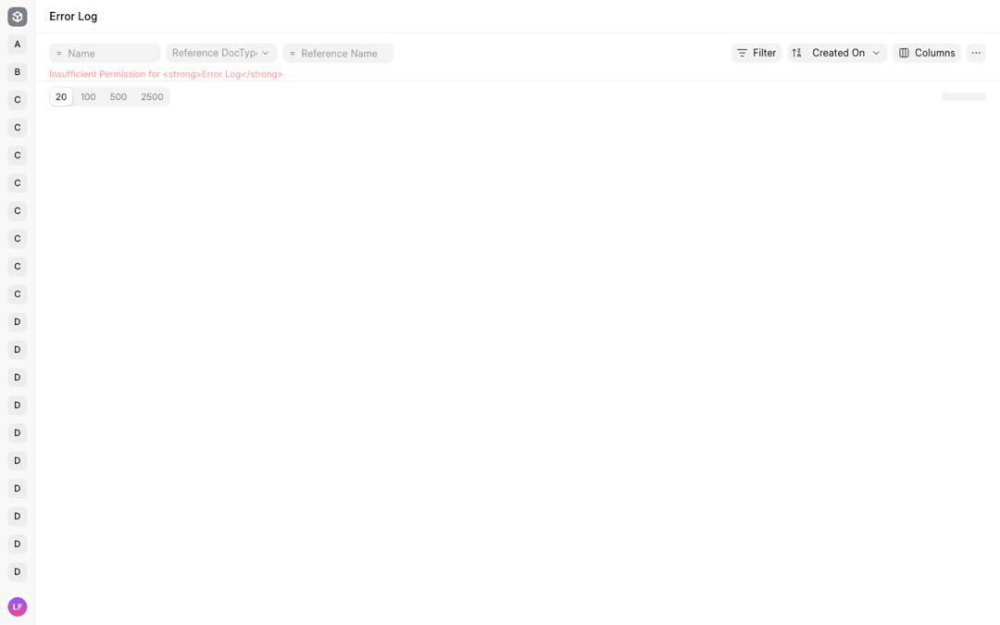

### Offline (page loaded first, then the network cut)

| Step | What the person sees |
| --- | --- |
| Go to the list through the sidebar | The rows are removed. Red text "TypeError: Failed to fetch" under the filter row; the footer count is a skeleton bar that never resolves. No retry button, no "you are offline" |
| Back to a record visited before | The record paints from memory as if online. Its background re-read fails silently |
| Edit and Ctrl+S | Save spinner, then toast "TypeError: Failed to fetch". The edit is kept |
| Type a quick filter | The rows are removed and a skeleton stays in the pane (3 s and counting), with the fetch error text |
| Reload the page | The browser's own offline page |

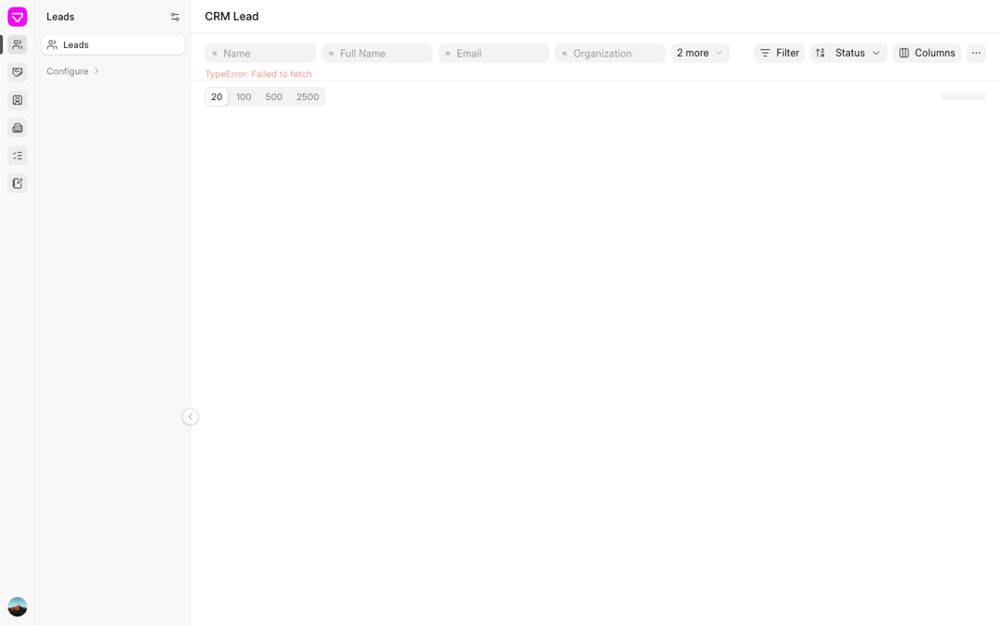

## 2. Keyboard access

### Tab order

| Page | Tab stops before the page's own content | Notes |
| --- | --- | --- |
| CRM list | 14 (rail menu, an unlabelled focusable div in the rail, 6 rail links, avatar, sidebar customise, an unlabelled sidebar div, sidebar link, "Configure", "Collapse sidebar") | Then: page title button, 4 quick-filter inputs each followed by a "Like" operator button, "2 more", Filter, an **unnamed** sort-direction button, sort field, Columns, More, the scrolling table div, Select all, 2 header sort buttons, then **2 stops per row**: the row link and its checkbox |
| CRM record | 14 (same shell stops) | Then: breadcrumb link, title, favourite, More actions, the "Activity" tab, feed items (reply buttons, an email `iframe` with no focus ring, attachment links), scroll-to-top, composer buttons, panel buttons (Email, Comment, Attach, Print, Copy link, Tags), "Assigned to", "Shared with", the "Details" and "Person" section toggles, then back to the rail |
| Framework ToDo record (`/apps/desk`) | **228**: the framework rail lists every doctype as its own link | The record's first field is Tab press 229 |

There is no skip link on any page.

Gaps found:

- **The record panel's field values cannot be reached by keyboard.** Each value in the right
  panel (Organization, Website, Job Title, Email and so on) is a `div` with `tabindex=-1` and a
  click handler. Tab goes from the "Person" section toggle straight back to the rail. The same
  fields can be edited from the Details tab, where they are ordinary inputs.
- Each list row gives two Tab stops, and the checkbox (`role=checkbox`, `tabindex=0`) sits
  inside the row's link (`ui/src/experimental/List/List.vue:90-94`).
- Arrow keys do nothing in the list. Enter on a focused row opens it (it is a real link).
- The sort-direction button next to the sort field has no accessible name.
- Focus is not moved on navigation: after every page change it is on `body`, so the next Tab
  starts again at the rail.

### Shortcuts that exist

| Key | Where | Does |
| --- | --- | --- |
| Ctrl/Cmd+S | Record | Save; with nothing changed, toast "No changes to save" (`frontend/src/pages/Record.vue:859-865`) |
| Esc | Panel field being edited | Put the value back |
| Ctrl/Cmd+Enter | Comment or email writer; comment edit | Send / save |
| Enter, Space | List row checkbox | Toggle |
| Arrow keys | Record tab strip | Move between tabs (frappe-ui Tabs) |

Tried and found to do nothing: Ctrl/Cmd+K, `/`, Ctrl/Cmd+G, Ctrl/Cmd+B. There is no search
or command shortcut, and no list navigation keys.

## 3. Consistency breaks

Each row is one event that looks or behaves differently on two pages.

| Event | Page A | Page B |
| --- | --- | --- |
| Return visit | Record: painted from memory, no skeleton | List and home: skeleton again on every return (0.45 s on slow). Home keeps no cache at all (`frontend/src/contents.ts:42-68` clears the tiles before each fetch) |
| Not found | Record: header plus a small red "Not found." line | Unknown address or doctype: centred "Not found / This page does not exist. / Back to apps" |
| Network failure | Record, cold: "Not found." (every failure that is not a 403 is reported as not found, `readFailure` in `frontend/src/pages/Record.vue:615-619`) | List: the raw message "TypeError: Failed to fetch" (`frontend/src/pages/list/DoctypeList.vue:48-50`) |
| No permission | Record: a sentence, "You do not have permission to read this record." | List: the server's message with its HTML tags shown as text, and the controls still drawn |
| Load error colour (from the code) | List and record: red text | Home and module: grey text ("Could not load this app's navigation." at `frontend/src/pages/Home.vue:14`) |
| Error while saving | A toast, bottom right | A load error: inline text in the page. Neither has a retry, and none is a live region |
| Validation message | Email check: "not-an-email is not a valid Email Address" | Mandatory check: "Error: Value missing for ToDo: Description" (with an "Error:" prefix) |
| Empty result | A list with no rows: "No records" | A filter that matches nothing: the same "No records", with no hint that a filter is on beyond the "Filter 1" button |
| Empty feed (from the code, not walked) | Activity tab: "No activity yet" | A feed that failed to load: also "No activity yet"; `ActivityTimeline` has no error branch |
| Sort and filter memory | Filter: in the URL (by replace) | Sort: saved to the person's settings, not in the URL, so a copied link does not carry it |
| Skeleton shape | List skeleton: 4 columns | Deals list: 5 columns. Record skeleton: a 2-column form; the lead and deal pages open on the Activity timeline |
| Loading feedback | Within a page (a filter, a save): a skeleton or a spinner | Between pages: nothing until the next page's code arrives (6.5 s and 26 s pauses on slow) |
| Focus in a dialog | Share dialog (from the code): focus on its picker (`autofocus` at `frontend/src/pages/record/panel/ShareDialog.vue:8`) | Conflict and discard dialogs: focus on the close (×) button, not on either answer |

## 4. Comparison with desk v1 and CRM's own frontend

The ticket asks for CRM's newer frontend. That frontend ("frontend2", served at `/crm2`)
is not on this bench: the crm checkout is on its `desk-v2` branch (`70d47a297`), which has no
`frontend2` folder, and `/crm2/...` now falls into the desk v2 shell's "Not found". It lives
on the unbuilt branch `feat/crm-frontend2`, and building it was out of bounds for this walk.
So the comparison uses CRM's current Vue UI, served by the backend at
`crm.localhost:8019/crm/leads/<name>` from the bundle built on 2026-09-24. Desk v1 is the form
at `/desk/fcrm/crm-lead/<name>`. Both were walked on the lead `CRM-LEAD-2026-00004`, with the
same slow network as above.

### Open a record cold

| | Desk v1 form | CRM Vue UI | Desk v2 |
| --- | --- | --- | --- |
| Normal network | White page until ~1.2 s, then the whole form at once. No skeleton or spinner | White ~250 ms, then the shell, header and tabs, with a centred spinner and "Loading..." in the activity area; filled by ~700 ms | White ~180 ms, one frame of skeleton, the record by ~0.3 s |
| Shift | 0.156, once, when the form appears | Four small shifts, the largest 0.03 | 0.17 (the sidebar pushes the pane right) |
| Slow network | App-logo splash from 3 s to ~115 s, a grey page, the form at ~136 s | White until ~90 s, then the page | White until 73 s, skeleton 5 s, the record at ~99 s |
| Tab title | "Frappe" while loading | Changes to the record's name | "Frappe" always |
| Something open over the record | No | A "Getting started" help panel opens by default and covers the side panel | No |

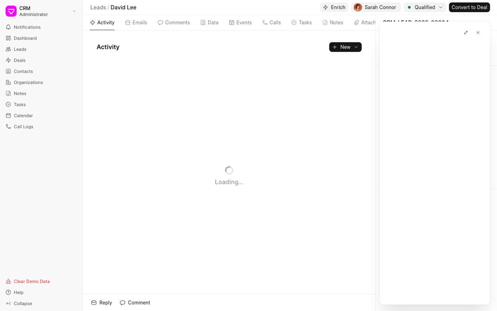

*CRM's Vue UI at 300 ms: the shell draws first and the activity area has a spinner.*

### Edit a field and save

| | Desk v1 form | CRM Vue UI | Desk v2 |
| --- | --- | --- | --- |
| How | Ctrl/Cmd+S or Save | Enter or leaving the field saves that field (`frappe.client.set_value`) | Ctrl/Cmd+S or Save; nothing saves on its own |
| While saving | An orange "Not Saved" pill | Nothing | A spinner on the Save button |
| Saved | A dark "Saved" toast with a check by 300 ms; the pill goes back to the status | "Document updated successfully" toast by 300 ms | The Save button turns grey. No toast |
| Focus after | body | Stays in the input | body |

### Save with an error

| | Desk v1 form | CRM Vue UI | Desk v2 |
| --- | --- | --- | --- |
| Invalid email | The field gets a red border as soon as you leave it (checked in the browser). Save then opens a "Message" dialog: "not-an-email is not a valid Email Address" | Toast, bottom right, with the same server text | Toast, bottom right, with the same server text |
| Required field empty | Checked before any request. Dialog "Missing Fields": "Please fill the following mandatory fields before saving: First Name is required." The field and its section are highlighted | Checked before any request. Toast "Mandatory fields required: First Name" | Sent to the server. Toast "Error: Value missing for ToDo: Description" |
| Field marked | Yes | No | No |
| Edit kept | Yes | Yes | Yes |
| Focus after | The dialog, then body after Esc | Stays in the input | body |

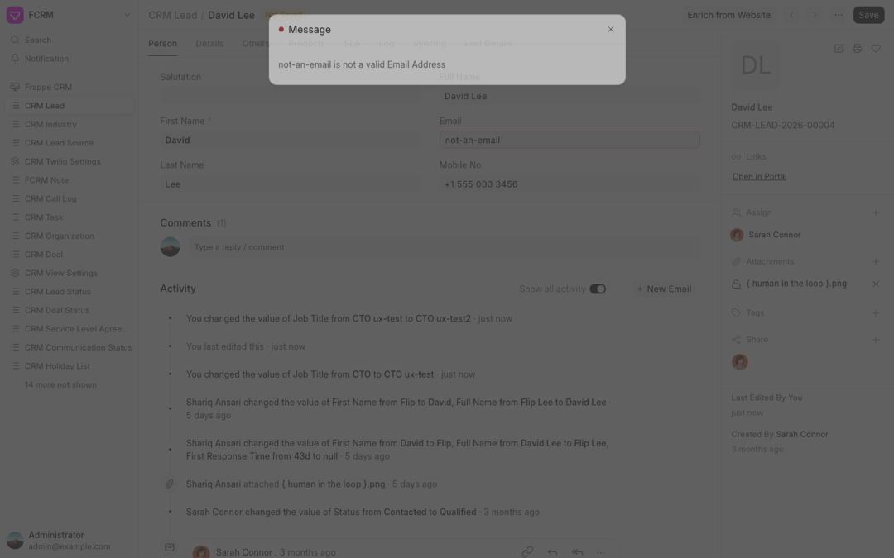
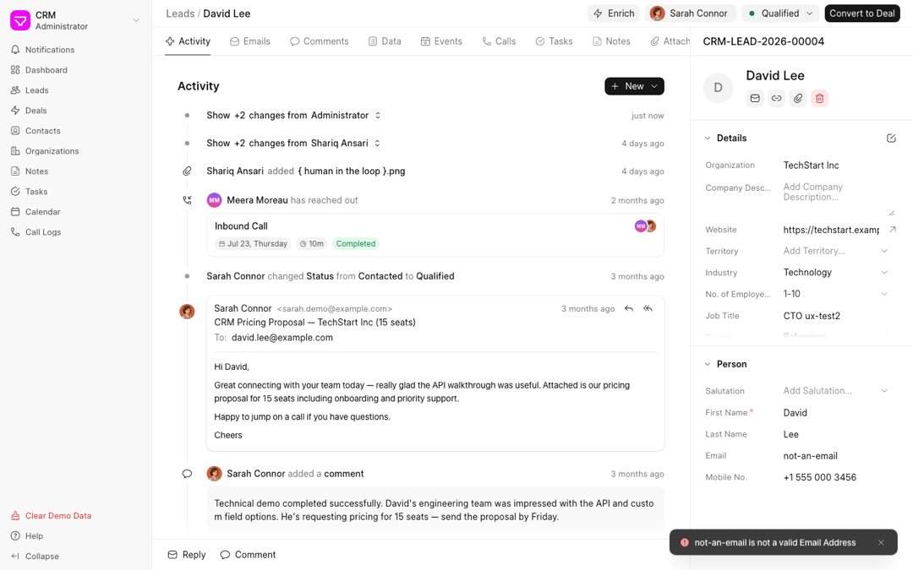

### Keyboard, side by side

| | Desk v1 form | CRM Vue UI | Desk v2 |
| --- | --- | --- | --- |
| First 15 Tab presses | All in the sidebar's doctype links; the form is not reached | Start inside the activity list, skipping the sidebar, header and tabs; 8 of them land on hidden tab panels placed off-screen | 14 shell stops, then the header |
| Side panel fields | (no side panel fields) | Not reached | Not reached |
| Shortcut list | Shift+? opens one: Cmd+K, Cmd+G, Cmd+B, Cmd+J, Cmd+E, Cmd+P, next/previous record, undo, and more | None; on the record, Shift+?, Cmd+K and Cmd+S do nothing | None; Ctrl/Cmd+S only |

In one line: desk v2 shows something sooner than both on a normal network, but it says the
least after a save (no toast, no marked field, focus dropped); desk v1 marks the bad field and
has the fullest keyboard; CRM's UI keeps focus in the field and confirms every save.

## 5. The worst moments, in one list

1. On a slow network a cold record is a white page for 73 s; the shell does not draw first.
2. On a slow network a row click leaves the list on screen for 26 s with no sign anything happened.
3. The record panel's fields cannot be reached with the keyboard.
4. Offline, the list throws its rows away and shows "TypeError: Failed to fetch" with no retry.
5. A list the person may not read shows `<strong>` tags as text, and a skeleton that never ends.
6. A save gives no confirmation; a failed save names no field.
7. Every page's tab title is "Frappe".

## Sources

- The walk itself, on the commit and site above.
- `frontend/src/router/index.ts:74` (the router waits for page code), `frontend/src/router/mainPage.ts:30-35`.
- `frontend/src/pages/Record.vue:609-619` (read failures), `:859-865` (Ctrl+S).
- `frontend/src/pages/list/DoctypeList.vue:11-13, 48-50` (list errors), `frontend/src/list/useListRows.ts:123-131` (a new query empties the rows), `frontend/src/list/useListPage.ts:165-167, 186` (URL by replace, sort saved to settings).
- `frontend/src/contents.ts:42-68` (home refetches every mount), `frontend/src/pages/Home.vue:14`.
- `ui/src/experimental/List/List.vue:90-94, 137` (row checkbox, "No records").
- `frontend/index.html:23` (the one page title).
